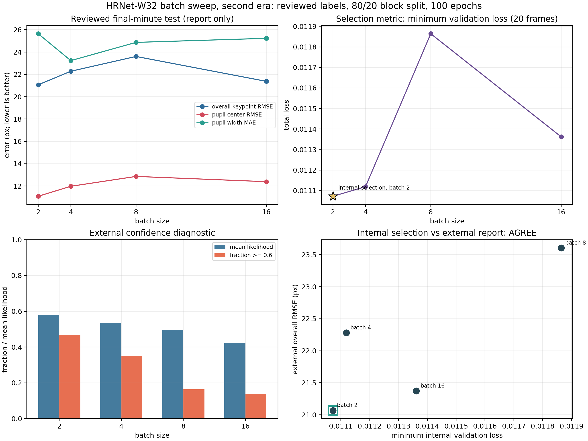
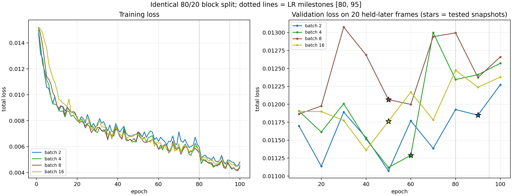
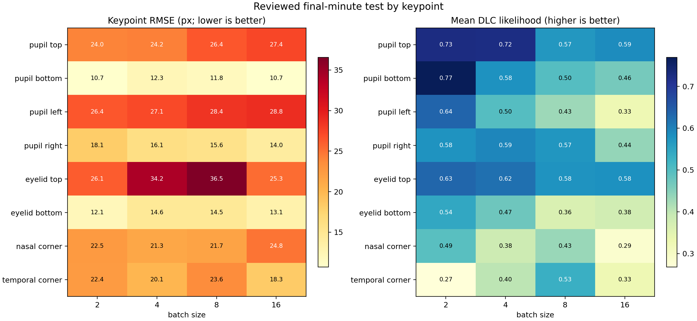
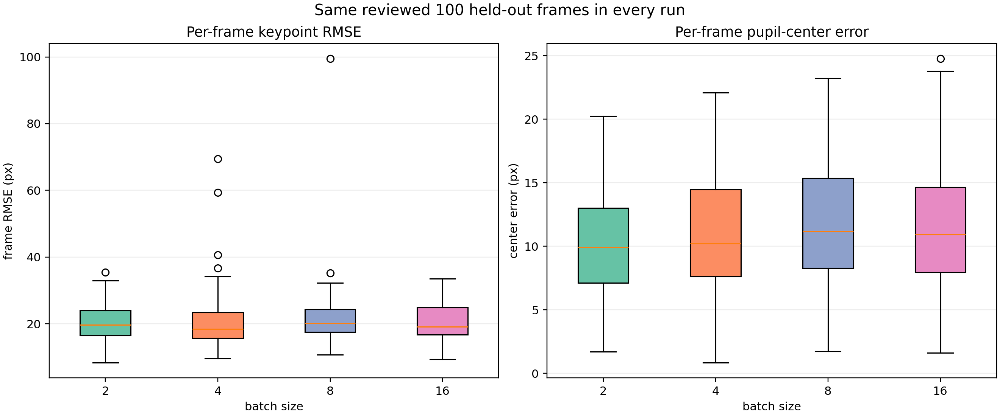

# HRNet-W32 Batch-Size Sweep, Second Era

## Question

With reviewed labels, a temporal block split, and a 100-epoch budget, which
batch size does the 20-frame internal validation set select, and does the
untouched final-minute set agree?

## Locked Design

- Labels: all 100 training-pool frames and all 100 final-minute frames
  re-reviewed on 2026-09-10; the `pupil_top` definition moved ~20 px, so
  nothing here is comparable with tags v0.1.0 / v0.2.0.
- Split: temporal block, the chronologically first 80 labelled frames train,
  the last 20 validate, boundary gap 1.2 s, advisor-approved. Training sees
  0-33 s; validation extrapolates to 34-236 s; the final minute extrapolates
  further.
- Schedule: 100 epochs on CPU, LR milestones rescaled to [80, 95],
  snapshots every 10 epochs, interrupted runs restart from scratch.
- Within-run checkpoint: DeepLabCut `snapshot-best-*` by maximum internal
  `test.mAP`. Across batches: lowest minimum internal validation total loss.
  Both rules were declared before any result was inspected.
- External test: the same reviewed 100 final-minute frames, 800
  keypoints, report-only. It selects nothing.

## Results

| Batch | Best epoch | Min valid loss (epoch) | Overall RMSE | Center RMSE | Width MAE | Likelihood >= 0.6 | Hours |
|---:|---:|---:|---:|---:|---:|---:|---:|
| 2 | 90 | 0.01107 (50) | 21.07 px | 11.08 px | 25.64 px | 375/800 | 3.7 |
| 4 | 60 | 0.01112 (50) | 22.28 px | 11.98 px | 23.23 px | 280/800 | 2.6 |
| 8 | 50 | 0.01186 (10) | 23.61 px | 12.86 px | 24.87 px | 131/800 | 2.3 |
| 16 | 50 | 0.01136 (40) | 21.37 px | 12.39 px | 25.23 px | 111/800 | 3.6 |

The internal rule selects **batch 2** (minimum
validation loss 0.01107 at epoch
50). The final-minute set is
lowest at **batch 2**
(21.07 px overall RMSE).

**The internal and external signals agree**: the 20-frame validation rule selects batch 2, and the untouched final-minute set independently ranks the same batch lowest (21.07 px). In the first era the two signals disagreed, which is what exposed the five-frame validation set. Agreement here is the first evidence that the rebuilt validation set can be trusted for the architecture comparison and the active-learning rounds.

## Figures

## Interpretation

1. Internal validation losses span 7.1% across batches and external
   errors span 12.1%. In the first era those numbers were 5.8% and
   156%: the internal signal had no resolving power. The reviewed labels and
   the 4x larger, temporally separated validation set are what changed.
2. Best snapshots now land mid-training (epochs
   90, 60, 50, 50), not at
   epoch 10-20 as in the first era, another sign the validation signal became
   meaningful.
3. Validation here measures forward temporal extrapolation (34-236 s from
   0-33 s training), the same condition the final-minute set measures further
   out. That alignment is by design.
4. Batch sizes are not update-matched: at 100 epochs, batch 2 makes 8x more
   optimizer steps than batch 16. This is a fixed-epoch sweep; runtime scales
   accordingly (see the hours column).
5. Single run per batch size. Only large gaps are interpretable.

## 中文摘要

复查标注 + 时间块 80/20 划分 + 100 epoch 下的 batch size 重扫。内部规则
（20 帧验证集最低验证损失）选出 batch 2；最后一
分钟测试集最低的是 batch 2。内部与外部信号一致：20 帧验证规则选出 batch 2，未参与任何选择的最后一分钟测试集也独立地把它排在最低（21.07 px）。第一时代正是两个信号打架暴露了 5 帧验证集的问题；这次一致，是重建后的验证集可以信任的第一个证据。

新旧时代不可比：标注定义（尤其 pupil_top，约 20 px）、划分、epoch 预算都变
了。每个 batch 只跑一次，只有大差距可解读。

## Files

- `batch_size_summary.csv`: one audited row per run.
- `keypoint_metrics.csv`: per-keypoint RMSE and likelihood.
- `learning_curves.csv`: epoch-level train/validation records.
- `selection.json`: declared rules and both selections.
- `audit.json`: label review, split, config, and isolation checks.

Raw videos, frames, labels, predictions, and model weights stay in ignored
local directories and are not on GitHub.
