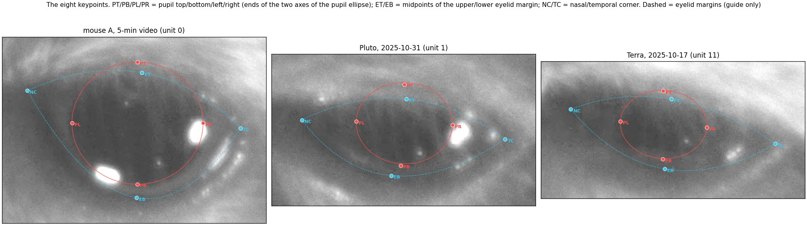
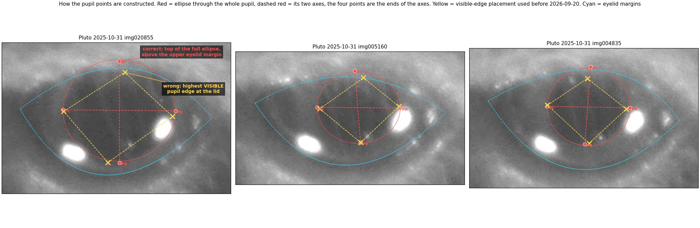
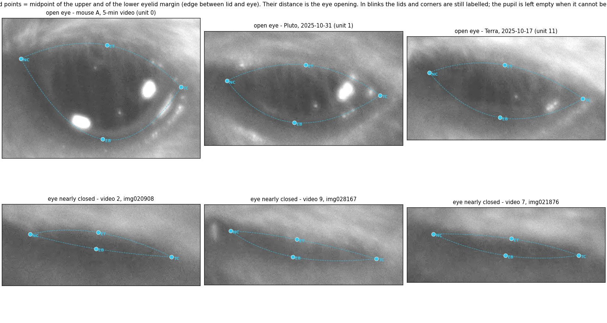
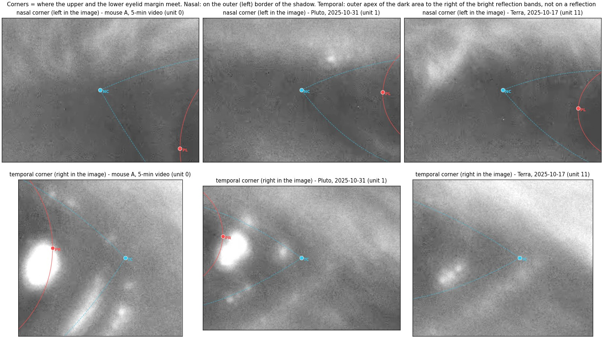
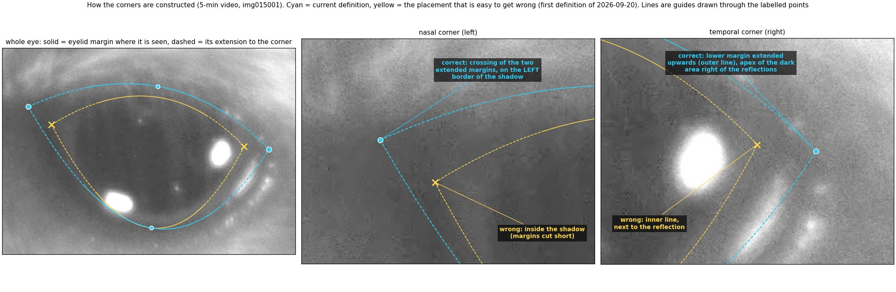
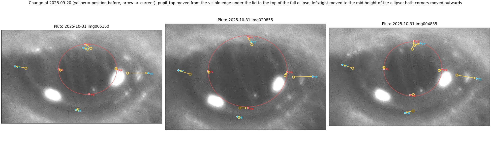
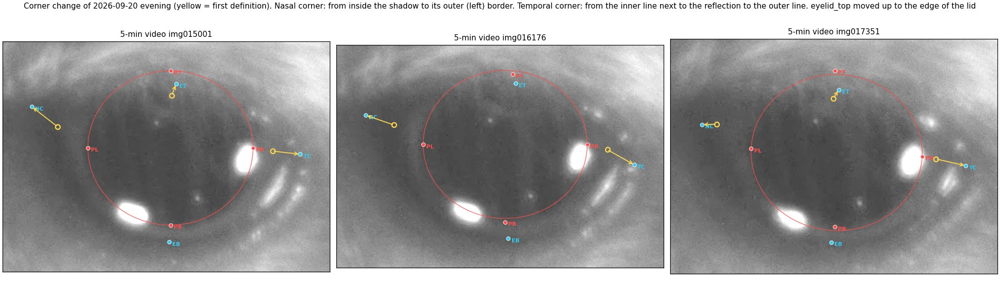
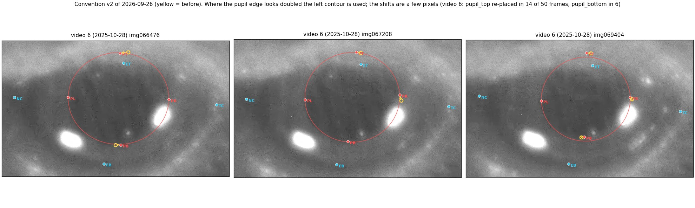

# 点位定义和明确（小鼠眼睛 8 个点）

每个点标在哪里、项目过程中标法改过什么、哪些地方容易标错。`v2_new_pupil_top_video_scaling/` 下所有标注都以这里为准
（当前状态：2026-09-20 的椭圆标准和外侧眼角、2026-09-26 的约定 v2、2026-09-29 的瞳孔亮带裁定）。
英文版：[README.md](README.md)。

所有例图都调亮了（gamma 0.45），否则眼睛区域太暗看不清。这些视频里鼻侧在图像左边，颞侧在右边。

## 名词

| 这里的叫法 | 专业名称 | 含义 |
|---|---|---|
| 眼睑和眼睛的分割线 | 睑缘（上睑缘 / 下睑缘，eyelid margin） | 眼皮皮肤结束、眼球表面开始的那条边 |
| 睁眼的开口 | 睑裂（palpebral fissure） | 上下睑缘之间的开口 |
| 左眼角 | 内眦（鼻侧眼角，medial canthus），标签名 `eye_nasal_corner` | 上下睑缘在鼻侧的交点（图像左边） |
| 右眼角 | 外眦（颞侧眼角，lateral canthus），标签名 `eye_temporal_corner` | 上下睑缘在耳侧的交点（图像右边） |
| 反光 | 红外灯在角膜上的反光 | 亮斑和亮带，不是解剖结构 |

## 定义

### 瞳孔：`pupil_top`、`pupil_bottom`、`pupil_left`、`pupil_right`

把瞳孔看作椭圆，四个点是椭圆两条轴的四个端点：左、右是横轴的两端，上、下是纵轴的两端。

1. 椭圆是整个瞳孔，包括被上眼睑或毛挡住的部分。所以 `pupil_top` 经常在 `eyelid_top` 上面（图 1，老鼠 A）。
2. 椭圆可以是斜的。点只要在轴的端点上；左右两点不要求等高，但要在椭圆的半高处，不是可见轮廓最宽的地方。
3. 瞳孔边界取变暗区域的外缘。黑核外面那圈较亮的带（毛发遮挡、红外灯照亮）也是瞳孔。
4. 边界看起来有两层轮廓时，取左边那层；`pupil_top` 和 `pupil_bottom` 随之偏左。
5. 瞳孔看起来不规则（菱形、一侧凹进去）时，仍然用椭圆近似。看不见的一侧，按另外三个点确定的椭圆推出来。
6. 反光压在瞳孔边界上时不管反光：边界从反光下面延续过去（图 1 的 `PR` 标在瞳孔边界经过亮斑的位置）。
7. 瞳孔完全看不见（闭眼）时，四个瞳孔点留空。

瞳孔点的作图：椭圆覆盖整个瞳孔，红色虚线是它的两条轴，四个点是轴的端点。黄色是按可见边缘标的旧画法。

### 眼睑：`eyelid_top`、`eyelid_bottom`

`eyelid_top` 是上睑缘的中点，`eyelid_bottom` 是下睑缘的中点（两个眼角之间那段弧线的中点）。睫毛和毛发不算：
睑缘取深色眼睛区域的边。两点之间的距离就是睁眼度，所以两点不要求在同一条竖线上。每一帧都要标，眨眼时也要标。

### 眼角：`eye_nasal_corner`、`eye_temporal_corner`

眼角是上睑缘和下睑缘的交点；交点本身看不清时，把两条睑缘延长到相交。

- **左眼角（鼻侧）。** 这个角通常有一片阴影。沿着阴影左侧（外侧）的边线走，取它和上睑缘的交点。
  不要标在阴影里面，也不要标在阴影右边界上。
- **右眼角（颞侧）。** 这个角旁边有几条反光亮带。眼角是反光右侧那片深色区域的右侧顶点，
  也就是把下睑缘的弧线向上延伸得到的外层那条线（每一帧都看得见）。不要标在反光上，也不要标在紧挨反光的内层线上。

两个眼角和两个眼睑点只用于判断眨眼，所以优先选每一帧都能找到的稳定位置，而不是追求绝对精确。

眼角的作图：实线是看得见的睑缘，虚线是它的延长线，眼角是两条线的交点。黄色是容易标错的画法。

## 改了什么：在新旧两版都标过的同一批帧上实测

数字来自 `scripts/compare_label_versions.py`（`results/label_changes.csv`）；+x 向右，+y 向下。

**A. 2026-09-20，椭圆标准和外侧眼角**（Pluto 2025-10-31，40 帧，改之前和改之后都标过）：

| 点 | 帧数 | 位移中位数 | 平均位移 (x, y) | 改了什么 |
|---|---|---|---|---|
| pupil_top | 32 | 52.4 px | −8.9, −45.9 | 从可见瞳孔的最高处改到完整椭圆的顶端 |
| pupil_right | 36 | 14.9 px | −0.6, −15.2 | 改到横轴端点（椭圆半高处） |
| pupil_left | 33 | 14.2 px | −2.0, −9.7 | 同上 |
| pupil_bottom | 38 | 13.5 px | −4.2, −4.3 | 纵轴端点 |
| eyelid_top | 40 | 16.5 px | −2.1, −10.9 | 上移到睑缘 |
| eyelid_bottom | 40 | 20.1 px | −17.6, −1.5 | 改到新眼角之间下睑缘的中点 |
| eye_nasal_corner | 37 | 38.5 px | −37.3, −11.2 | 外移到阴影左边界 |
| eye_temporal_corner | 37 | 67.9 px | +61.6, +6.0 | 外移到外层线 |

**B. 单独看眼角那次修改**（5 分钟视频，90 帧，两版都已是椭圆标准）：左眼角 39.8 px（向左上）、右眼角 56.3 px
（向右下），90 帧全部移动；`eyelid_top` 16.9 px（向上），90 帧里 62 帧移动；瞳孔四点和 `eyelid_bottom` 没动。
所以 A 其实是同一天做的两次修改：瞳孔点随椭圆标准改，眼角和 `eyelid_top` 随眼角定义改。

**C. 2026-09-26，约定 v2（双轮廓取左边）：** 只有瞳孔点动了，幅度几个像素。视频 6 测试集：`pupil_top` 50 帧里
重标 14 帧，`pupil_bottom` 6 帧，`pupil_right` 4 帧。视频 7：每个点最多 4 帧。视频 8 瞳孔边界很难看清：
每个瞳孔点 20–31 帧。

**D. 2026-09-29，瞳孔亮带：** 没有改任何标注，只是确认了已有标法（上面第 3 条）。

## 容易标错的地方

| 错误标法 | 正确标法 | 例图 |
|---|---|---|
| `pupil_top` 标在眼睑下方可见的瞳孔边上 | 完整椭圆的顶端，必要时在眼睑下面 | 图 8 黄叉 |
| `pupil_left` / `pupil_right` 沿可见轮廓标，高低不一 | 椭圆横轴的两个端点 | 图 4 |
| 瞳孔点标在反光的边缘 | 标在瞳孔边界上，边界从反光下面延续 | 图 1 的 `PR` |
| 只取黑核，把外面较亮的带排除 | 取变暗区域的外缘 | 第 3 条 |
| 双轮廓取了右边那层 | 取左边那层 | 图 6 |
| 左眼角标在阴影里面 | 阴影左边界与上睑缘的交点 | 图 7 中间 |
| 右眼角标在内层线或反光亮带上 | 反光右侧深色区域的右顶点 | 图 7 右边 |
| 眨眼帧眼睑点留空 | 眼睑和眼角必须标，只有瞳孔留空 | 图 3 下排 |
| 某个点被拖到很远的地方，或两个眼角标反 | 每批保存后自动跑的几何检查会报出来 | – |

## 文件

- `scripts/kp_render.py`：读标注、画带点位的帧。
- `scripts/make_figures.py`：生成 `figures/fig1`–`fig8`。
- `scripts/compare_label_versions.py`：生成 `results/label_changes.csv`。

脚本读取的标注和帧只在本地（不进 git）。
