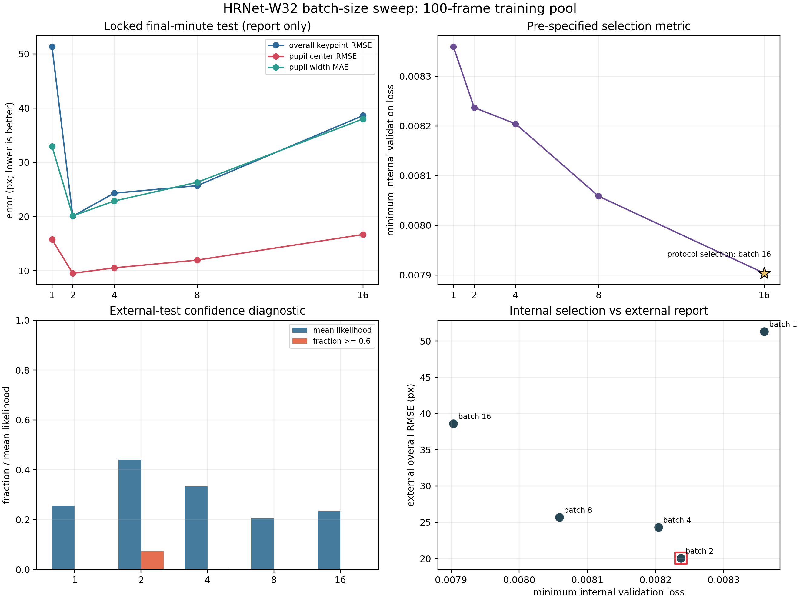
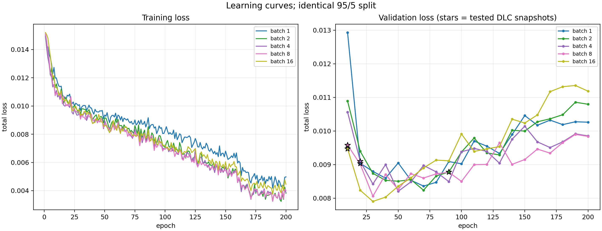
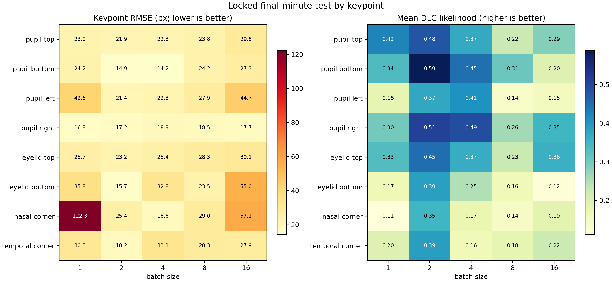
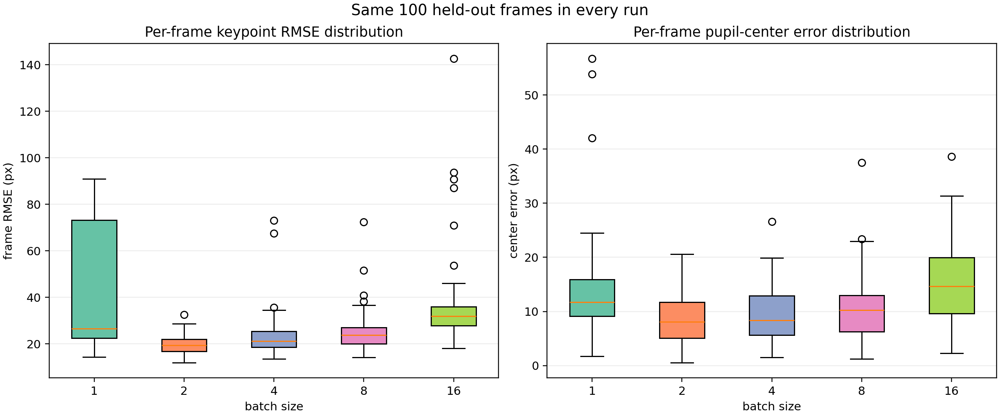

# HRNet-W32 Batch-Size Sweep

## Question

This experiment tests batch sizes `1, 2, 4, 8, 16` before fixing a
batch size for the architecture comparison. Every run uses HRNet-W32.

## Locked Design

- Training pool: 100 frames from the first four minutes.
- Internal split: identical 95 training / 5 validation frames.
- Schedule: 200 epochs on CPU.
- External test: identical 100 manually labeled final-minute frames
  containing 800 keypoints.
- Final-minute labels were never added to training.
- Within-run checkpoint: DeepLabCut `snapshot-best-*`, selected by
  maximum internal `test.mAP`.
- Across-batch rule: lowest observed internal validation total loss.
  External-test error is report-only.

## Results

| Batch | DLC best epoch | Min valid loss (epoch) | Overall RMSE | Center RMSE | Width MAE | Likelihood >= 0.6 |
|---:|---:|---:|---:|---:|---:|---:|
| 1 | 20 | 0.00836 (70) | 51.31 px | 15.76 px | 32.95 px | 0/800 |
| 2 | 90 | 0.00824 (70) | 20.06 px | 9.53 px | 20.11 px | 59/800 |
| 4 | 20 | 0.00820 (50) | 24.31 px | 10.53 px | 22.86 px | 2/800 |
| 8 | 10 | 0.00806 (30) | 25.68 px | 11.96 px | 26.31 px | 0/800 |
| 16 | 10 | 0.00790 (30) | 38.61 px | 16.68 px | 37.99 px | 0/800 |

The pre-specified internal criterion selects **batch 16** (minimum validation loss 0.00790 at epoch 30). The locked external test has its lowest overall RMSE at **batch 2** (20.06 px), but that result must not be used retroactively to select hyperparameters.

## Figures

## 中文摘要

按实验开始前固定的内部验证损失规则，应选择 **batch 16** 进入下一步模型架构比较。最后一分钟测试中 batch 2 的观测误差最低，但该测试集只能用于最终报告，不能反过来改变超参数。内部验证集只有 5 张图片，而且每个 batch size 只运行了一次，因此当前 batch 选择应视为暂定结果。所有模型的置信度校准都较弱，在校准前不应直接使用 `pcutoff=0.6` 过滤预测点。

## Interpretation

1. Internal validation and final-minute test rankings disagree. The
   internal validation set has only five images, and minimum validation
   losses span only 5.8% across all runs.
2. Batch 2 is the strongest external-test observation: overall RMSE 20.06 px, pupil-center RMSE 9.53 px, and pupil-width MAE 20.11 px. This is report-only, not a valid reason to change the frozen rule.
3. Confidence is poorly calibrated. Only batch 2 produces more than 2/800 predictions with likelihood >= 0.6, and it has only 59/800. Do not use `pcutoff=0.6` as a hard filter before calibration.
4. Tested snapshots are not the epochs with minimum validation loss.
   DeepLabCut saves its best checkpoint by maximum internal mAP. Tested
   epochs are 20, 90, 20, 10, 10 for batches 1, 2, 4, 8, and 16.
5. Fixed epochs do not mean equal optimizer updates: larger batches
   make fewer updates per epoch. This is a fixed-200-epoch sweep, not a
   compute- or update-matched experiment.
6. Each batch size was run once. Small differences need repeated runs
   before they can be interpreted as precise batch-size effects.

## Decision

To preserve test-set isolation, use **batch 16** for the next architecture comparison because the pre-specified internal rule selected it. Treat this as provisional. Before a definitive production-model decision, use a larger internal validation set or repeated runs and freeze one internally consistent checkpoint/selection rule.

## Files

- `batch_size_summary.csv`: one audited row per run.
- `keypoint_metrics.csv`: per-keypoint RMSE and likelihood.
- `learning_curves.csv`: epoch-level train/validation records.
- `selection.json`: protocol and report-only selections.
- `audit.json`: completion and train/test isolation checks.
- `01_batch_size_overview.png`: metrics and ranking mismatch.
- `02_learning_curves.png`: train and validation trajectories.
- `03_keypoint_diagnostics.png`: keypoint heatmaps.
- `04_error_distributions.png`: per-frame errors and outliers.

Raw videos, frames, labels, predictions, outlier montages, and model
weights stay in ignored local directories and are not on GitHub.
