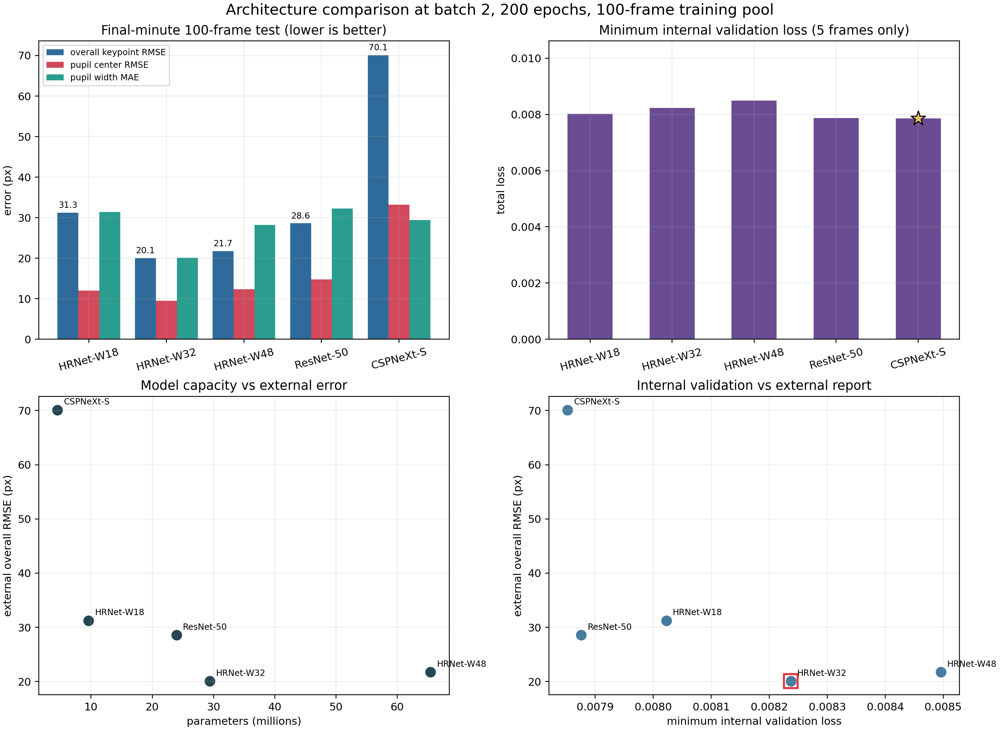
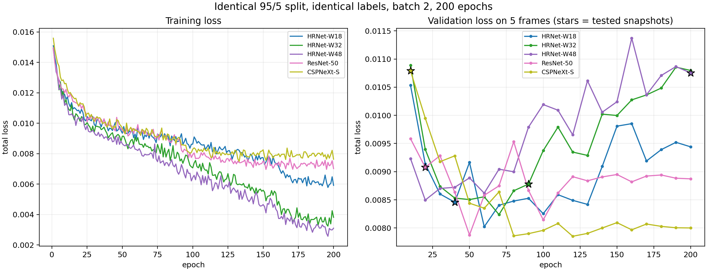
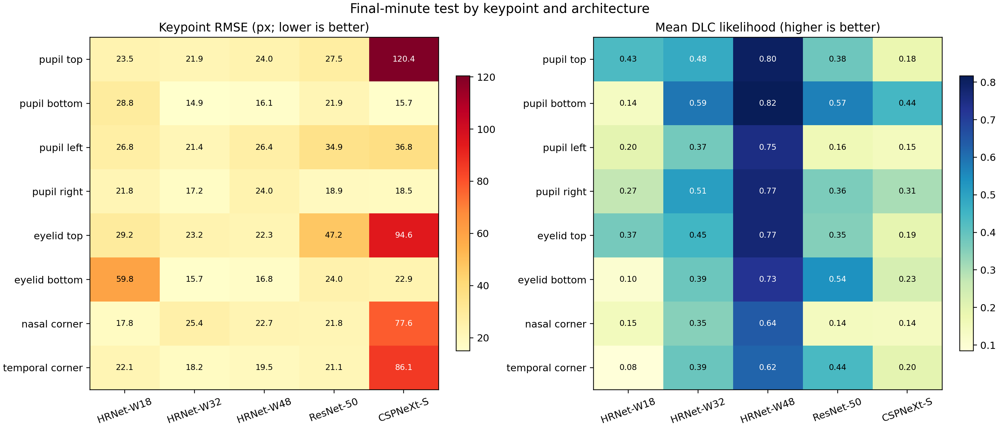
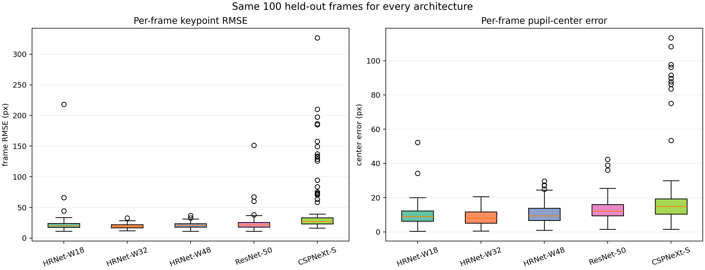

# Architecture Comparison at Batch 2

## Question

With the training pool, internal split, batch size, epoch budget, and external
test set all held fixed, which backbone gives the lowest final-minute error on
100 manually labeled eye frames?

## Locked Design

- Training pool: the same 100 manually labeled frames from the first four
  minutes of `face.mp4`.
- Internal split: the identical 95 training / 5 validation frames in every run,
  verified from each shuffle's DeepLabCut documentation pickle.
- Optimization: batch 2, 200 epochs, CPU, DLC seed 42.
- Within-run checkpoint: DeepLabCut `snapshot-best-*`, chosen by maximum
  internal `test.mAP`. The published metrics come from that snapshot. One
  documented exception is described under "Checkpoint Deviation".
- External test: the same 100 manually labeled final-minute frames in the same
  order, 800 keypoints total. Final-minute labels were never trained on.
- Excluded by design: RTMPose-S (shuffle 12) is a
  top-down pose model with an SSDLite detector; not controlled against the bottom-up single-eye models. It was stopped at detector epoch 30/250; its partial
  files are kept only for audit and appear in no result here.

## Results

| Model | Params | Tested epoch | Min valid loss (epoch) | Overall RMSE | Center RMSE | Width MAE | Likelihood >= 0.6 |
|---|---:|---:|---:|---:|---:|---:|---:|
| HRNet-W18 | 9.6 M | 40 | 0.00802 (60) | 31.25 px | 11.97 px | 31.41 px | 0/800 |
| HRNet-W32 | 29.4 M | 90 | 0.00824 (70) | 20.06 px | 9.53 px | 20.11 px | 59/800 |
| HRNet-W48 | 65.4 M | 200 | 0.00850 (20) | 21.74 px | 12.37 px | 28.21 px | 662/800 |
| ResNet-50 | 24.0 M | 20 | 0.00788 (50) | 28.60 px | 14.75 px | 32.22 px | 40/800 |
| CSPNeXt-S | 4.5 M | 10 | 0.00785 (120) | 70.12 px | 33.21 px | 29.40 px | 1/800 |

| Model | Median frame RMSE | P90 frame RMSE | Worst frame RMSE | Mean likelihood | Training wall clock |
|---|---:|---:|---:|---:|---:|
| HRNet-W18 | 20.02 px | 28.49 px | 218.04 px | 0.219 | not recorded |
| HRNet-W32 | 19.39 px | 24.95 px | 32.65 px | 0.440 | 8.43 h |
| HRNet-W48 | 20.76 px | 28.43 px | 36.66 px | 0.737 | not recorded |
| ResNet-50 | 21.81 px | 32.26 px | 151.21 px | 0.369 | 6.35 h |
| CSPNeXt-S | 27.04 px | 129.32 px | 326.63 px | 0.229 | 1.43 h |

**HRNet-W32 has the lowest external error** at
20.06 px overall RMSE, while
CSPNeXt-S is worst at 70.12 px
— a spread of 250% across backbones. The internal five-frame
validation rule would instead have picked **CSPNeXt-S**
(minimum validation loss 0.00785 at
epoch 120), and those
minima span only 8.2% across all five models.

## Checkpoint Deviation

One model could not follow the shared checkpoint rule:

- HRNet-W48: published from its final epoch 200 snapshot instead of the DeepLabCut snapshot-best selected by maximum internal test.mAP, because the best snapshot was destroyed by DeepLabCut's snapshot manager during a resumed run, and the snapshots holding the maximum internal mAP had already been pruned. Declared before any external error for this model was inspected.

Every surviving checkpoint of that model was also evaluated, so the deviation
can be checked rather than assumed:

| Model | Snapshot epoch | Internal mAP | Overall RMSE | Center RMSE | Width MAE | Published |
|---|---:|---:|---:|---:|---:|:--:|
| HRNet-W48 | 100 | 97.62 | 24.65 px | 11.87 px | 24.39 px | no |
| HRNet-W48 | 125 | not evaluated | 37.79 px | 13.04 px | 29.33 px | no |
| HRNet-W48 | 150 | 96.83 | 37.34 px | 18.53 px | 23.88 px | no |
| HRNet-W48 | 175 | not evaluated | 30.61 px | 12.32 px | 27.97 px | no |
| HRNet-W48 | 200 | 97.62 | 21.74 px | 12.37 px | 28.21 px | yes |

**HRNet-W48 remains inconclusive, not confirmed worse.** Every surviving checkpoint is worse than HRNet-W32 (21.74 px at epoch 200 versus 20.06 px), but the checkpoint the internal rule would have chosen is epoch 30, which no longer exists. Its internal metrics were the best of the run (mAP 98.02 and internal RMSE 12.47 px, against 97.62 and 13.79 px at epoch 200), and the other four models were all tested at similarly early epochs, so its external error is unknown and could have been lower. Do not claim this comparison ruled HRNet-W48 out. Settling it requires retraining HRNet-W48 with intact snapshot retention.

## Figures

## Interpretation

1. Model capacity does not buy accuracy at this label budget. The largest backbone (HRNet-W48, 65.4 M parameters) is not the most accurate; HRNet-W32 (29.4 M) is, and parameter count correlates only -0.64 with external RMSE. With 95 training frames the bottleneck is labels, not parameters.
2. Internal and external rankings disagree again, exactly as in the batch-size
   sweep. Five validation frames cannot separate models whose validation minima
   differ by 8.2%. Do not select architectures from that signal.
3. Validation loss rising while training loss falls is the expected shape for
   95 training frames, but it is measured on five frames and must not be read
   as a precise overfitting point.
4. Tested snapshots differ across models (HRNet-W18 40, HRNet-W32 90, HRNet-W48 200, ResNet-50 20, CSPNeXt-S 10), because DeepLabCut
   picks its best checkpoint by internal mAP. Equal epochs therefore do not
   mean equal effective training length.
5. Confidence stays poorly calibrated for every backbone: the best model
   reports only 59/800
   points at likelihood >= 0.6. `pcutoff=0.6` cannot be used as a hard filter
   before calibration, which also constrains the `uncertain` outlier detector
   in the active-learning stage.
6. Per-keypoint failures are structured, not uniform. For HRNet-W32,
   `nasal corner` is hardest
   (25.4 px) and `pupil bottom` is
   easiest (14.9 px). Pupil-center error
   (9.53 px best, from
   HRNet-W32) is smaller than overall keypoint RMSE because
   averaging four pupil points cancels part of the error.
7. Runtime is a wall-clock indicator only, not a compute-matched measurement.
   It includes evaluation passes, and for resumed or externally timed runs also
   system sleep and restarts. Do not read runtime as cost for: HRNet-W18, HRNet-W32, HRNet-W48.

## Limitations

- Single run per architecture, no seeds repeated. Small differences are not
  resolvable; only the large gaps are.
- The five internal validation frames were flagged as possibly mislabeled but
  deliberately left unchanged so the sweep stays internally consistent. They do
  not update weights, but they do drive checkpoint selection.
- The final-minute 100-frame set has been inspected and relabeled during
  earlier debugging, so it is a controlled comparison set, not a pristine test
  set. Future advisor-supplied video needs a new untouched confirmation set.
- Resumed runs whose duplicate epoch rows were collapsed to the last
  occurrence: HRNet-W48 (11 duplicate epoch rows collapsed).
- One model's checkpoint rule deviates; see "Checkpoint Deviation" for the
  cause and for the evidence on whether it can change the ranking.

## Decision

Use **HRNet-W32** as the fixed architecture for the three-branch
active-learning experiment: it has the lowest external overall RMSE, the lowest
pupil-center error among HRNet variants, the best likelihood behavior, and
mid-range runtime. State plainly in any report that this choice comes from the
final-minute comparison set rather than from the five-frame internal rule, and
that it rests on one run per architecture.

This is not a clean sweep. HRNet-W48 is inconclusive rather than beaten: the checkpoint its internal rule would have selected no longer exists, so its best achievable external error is unknown. Choosing HRNet-W32 anyway is defensible on the evidence that does exist plus cost: it wins against every model whose comparable checkpoint survived, it beats every surviving HRNet-W48 checkpoint, and it needs 2.2x fewer parameters, which matters because active learning retrains the model once per round. Retraining HRNet-W48 with intact snapshot retention is the only way to settle it, and that has not been done.

## 中文摘要

在标注池、内部划分、batch、epoch 和外部测试集全部固定的条件下比较五个
backbone。最后一分钟 100 帧上 **HRNet-W32** 误差最低
（总体 RMSE 20.06 px），
CSPNeXt-S 最差（70.12 px）。
内部 5 帧验证规则会选 CSPNeXt-S，与外部结果不一致——这与 batch
size 实验暴露的是同一个问题：验证集只有 5 帧，不足以区分模型。

在当前标注规模下，更大的模型并没有更准：参数量最大的 HRNet-W48（65.4 M）不是最优，最优的是 HRNet-W32（29.4 M），参数量与外部 RMSE 的相关系数只有 -0.64。在 95 张训练帧的条件下，瓶颈是标注量而不是参数量。

所有模型的置信度校准都很差（最优模型也只有
59/800 个点的
likelihood 达到 0.6），因此主动学习阶段的 `uncertain` 检测器不能直接依赖
`pcutoff=0.6`。每个架构只跑了一次，只有大的差距可信。RTMPose-S 因为被 DLC
配置成带 SSDLite 检测器的 top-down 模型，与其余 bottom-up 模型不可比，已按
设计排除。最后一分钟这 100 帧此前已被反复查看和修正，属于受控比较集，不是
干净的测试集；老师后续提供新视频时需要一套全新未污染的确认集。

## Files

- `architecture_summary.csv`: one audited row per architecture.
- `keypoint_metrics.csv`: per-keypoint RMSE and likelihood.
- `learning_curves.csv`: epoch-level train/validation records, duplicates from
  resumed runs collapsed.
- `checkpoint_sensitivity.csv`: external error at every surviving checkpoint of
  the model with the documented checkpoint deviation.
- `selection.json`: selection rules, rankings, and the exclusion record.
- `audit.json`: split, label, snapshot, and isolation checks.
- `01_architecture_overview.png`: external errors, internal loss, capacity, and
  the internal/external disagreement.
- `02_learning_curves.png`: train and validation trajectories.
- `03_keypoint_diagnostics.png`: per-keypoint RMSE and likelihood heatmaps.
- `04_error_distributions.png`: per-frame error distributions.

Raw videos, frames, labels, predictions, outlier montages, and model weights
stay in ignored local directories and are not on GitHub.
