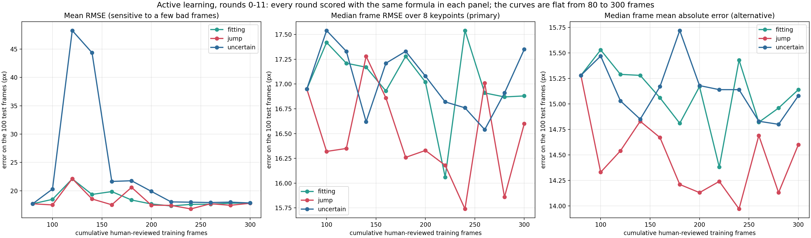

# Active learning: results (rounds 0-11)

Every number on this page is computed with one formula for all rounds: the per-frame RMSE over the 8 keypoints, then
the median over the 100 test frames (`median_frame_rmse_px` in `convergence.csv`). An earlier version of this page
mixed two formulas between rounds 0-5 and rounds 6-11 and reported a drop at round 6 that does not exist; those
statements were removed (history: tag `v0.5.1`, `CHANGELOG.md`).

## Basic information

- Video: the 5-minute eye video of the first mouse (60 fps). Frames 0-14399 (first 4 minutes) are the pool for frame
  selection and training; the final minute is used for testing only.
- Test set: 100 frames evenly spaced over the final minute, all 8 keypoints labeled by hand; report only.
- Start: 80 training frames + 20 validation frames (temporal block split; the validation set never grows).
- Each round, per branch: the current model predicts the 14,400 pool frames, the detector flags candidate frames,
  k-means picks 20 of them, a person corrects all 8 keypoints, the frames are added and the model is trained anew.
  Three detectors = three independent branches: `uncertain` (p_bound 0.6), `jump` (epsilon 20 px), `fitting`
  (epsilon 20 px). 11 rounds, 80 -> 300 training frames per branch.
- Model and settings: ResNet-50, batch 2, 100 epochs, LR drops at epochs 80 and 95, MPS, trained anew from
  ImageNet-pretrained weights every round, one run per point. Scored snapshot on this page: best internal validation
  mAP (the final-snapshot re-scoring is in the last section).
- Labeling rule (unchanged throughout): a keypoint is labeled when it can be seen clearly and left empty when its
  position cannot be judged accurately.
- Label standard: phase 1 (pupil top = highest point of the visible pupil). Not comparable with numbers under the
  ellipse standard of 2026-09-20.

## Results

- **About 80 labels saturate this video.** The median frame RMSE stays between 15.7 and 17.5 px from 80 to 300
  training frames in all three branches (round-0 baseline 16.95 px); there is no downward trend.
- **Detectors: no clear gap, jump slightly ahead.** Mean over rounds 1-11 of the median frame RMSE: jump 16.44 px,
  uncertain 17.04 px, fitting 17.03 px; jump is the lowest branch in 8 of the 11 rounds. The gap is about 0.6 px,
  smaller than the run-to-run variation of one setting, so jump cannot be called truly better. jump is the detector
  used in all later experiments.
- **The mean RMSE is driven by a few frames.** The `uncertain` branch reaches 48.3 and 44.4 px mean RMSE at 120 and
  140 frames while its median stays near 17 px; with the final snapshot these two points are 18.6 and 18.1 px (last
  section).

Caveats: one training run per point; the test set is one specific minute of one video.

## Files

- `convergence.csv` - all rounds and branches; `median_frame_rmse_px` (primary), `median_frame_mean_abs_px`
  (alternative formula, about 2 px lower on the same data), `external_overall_rmse_px` (mean RMSE).
- `01_convergence_curves.png` - drawn from `convergence.csv` by `../scripts/plot_convergence.py`.
- `round1_selection_report.json` - round-1 selections and collision audit.

## Production model (2026-09-15)

After the experiment one model was trained on the union of every human-reviewed label (80 seed frames + 596 unique
frames across all branches; same recipe; shuffle 60). Scored once on the same test set as `al_production_v1`:
**median frame RMSE 16.01 px** (round-0 baseline 16.95 px), 98% of points with confidence >= 0.6. This is the model
applied unchanged to the first video of the second mouse (the 0-label point of `../../new-video-generalization/`).

## Re-scored under the final-snapshot rule (2026-09-19)

`convergence_final_snapshot.csv`, `02_convergence_final_snapshot.png`,
`analysis-final-snapshot/scripts/rescore_final_snapshot.py`. Same 34 models,
same frozen test set; only the snapshot used for scoring changes, from
DeepLabCut's default (best validation mAP over all snapshots) to the final
snapshot (epoch 100). The recipe decays the learning rate at epochs 80 and
95; the default rule picked a pre-decay snapshot in 20 of 34 models (six
times epoch 30).

- **The early mean-error spikes were the snapshot rule.** uncertain rounds 2
  and 3 scored 48.3 and 44.4 px overall RMSE with their mAP-best snapshots
  (epochs 30 and 50) and score 18.6 and 18.1 px with their final snapshots.
  Across rounds 1-11 the overall RMSE has SD 6.89 px under the default rule
  and 1.04 px under the final-snapshot rule. When the default rule chose an
  epoch < 80 the two rules differ by 3.8 px on average; when it chose >= 80,
  by 0.1 px.
- **The saturation result stands and is cleaner**: median frame RMSE stays
  at 15.8-17.5 px from 80 to 300 labels (per-branch slopes +0.08, +0.05,
  -0.21 px per 100 frames); the 90th percentile stays at 21-25 px.
- **Detectors**: branch means over rounds 1-11 are jump 16.40, uncertain
  16.75, fitting 17.03 px (SD ~0.3 each). With the snapshot noise removed a
  small consistent ordering appears, but it is 0.3-0.6 px (under 4%), the
  rounds within a branch are not independent, and each point is one seed -
  practically negligible, not a basis for preferring a detector.
- The 120-frame spike analysis (`analysis-120frame-spike/`) attributed the
  spike to a "checkpoint lottery"; this re-scoring identifies the lottery's
  mechanism exactly.
